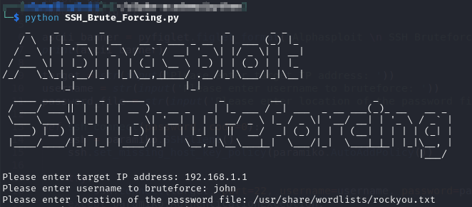

<h1 align="center">SSH Brute Force Tool. (☞ﾟヮﾟ)☞</h1>

The powerful Python language is supported by a number of modules that easily extend its capabilities. Paramiko is an SSHv2 implementation that will be useful in building SSH clients and servers

